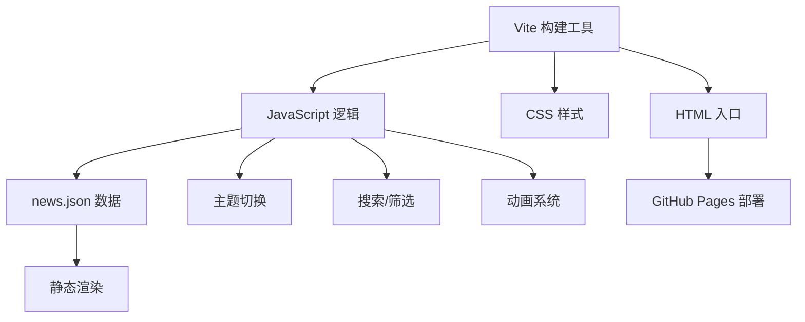

# 梯度前沿 Gradient Frontier — 技术架构文档

## 1. 架构设计



## 2. 技术选型

- **构建工具**：Vite 6.x
- **前端**：原生 HTML + CSS + JavaScript（ES Modules）
- **样式**：纯 CSS + CSS 自定义变量（CSS Custom Properties）
- **数据**：JSON 静态数据文件
- **部署**：GitHub Pages
- **无框架依赖**：不使用 React/Vue，保持极简

## 3. 项目结构

```
gradient-frontier/
├── index.html                    # 首页入口
├── archive.html                  # 归档页入口
├── vite.config.js                # Vite 配置
├── package.json                  # 项目配置
├── src/
│   ├── data/
│   │   └── news.json             # 资讯数据文件（核心内容源）
│   ├── styles/
│   │   ├── main.css              # 全局基础样式 + CSS变量
│   │   ├── theme.css             # 浅色/深色主题变量定义
│   │   ├── hero.css              # Hero区域样式 + 文字矩阵 + 光效
│   │   ├── nav.css               # 导航栏样式
│   │   ├── cards.css             # 资讯卡片样式
│   │   ├── archive.css           # 归档页样式
│   │   └── animations.css        # 滚动动画 + 过渡效果
│   ├── components/
│   │   ├── nav.js                # 导航栏（含主题切换）
│   │   ├── hero.js               # Hero区域（文字矩阵 + 鼠标光效）
│   │   ├── newsCard.js           # 资讯卡片组件
│   │   ├── search.js             # 搜索功能
│   │   ├── filter.js             # 分类/标签筛选
│   │   ├── archive.js            # 归档页逻辑
│   │   ├── modal.js              # 资讯详情模态框
│   │   └── theme.js              # 主题切换管理
│   └── utils/
│       ├── animations.js         # Intersection Observer 滚动动画
│       └── helpers.js            # 日期格式化、防抖等工具函数
├── public/
│   └── favicon.svg               # 站点图标
└── .trae/
    └── documents/
        ├── PRD-梯度前沿.md
        └── 技术架构-梯度前沿.md
```

## 4. 路由定义

| 路由 | 页面 | 说明 |
|------|------|------|
| `/` | 首页 | Hero + 资讯卡片流 |
| `/archive` | 归档页 | 按月分组的历史资讯 |

## 5. 数据模型

### 5.1 资讯数据 (`news.json`)

```json
{
  "news": [
    {
      "id": "string",           // 唯一标识
      "title": "string",        // 标题
      "summary": "string",      // 摘要（150字以内）
      "content": "string",      // 完整正文
      "tags": ["string"],       // 标签数组
      "source": "string",       // 来源名称
      "sourceUrl": "string",    // 来源链接
      "date": "YYYY-MM-DD",     // 发布日期
      "featured": false         // 是否精选
    }
  ],
  "categories": [
    {
      "id": "string",           // 分类ID
      "name": "string",         // 分类名称
      "icon": "string"          // 图标标识
    }
  ]
}
```

## 6. 核心实现细节

### 6.1 Hero 文字矩阵水印

- 使用 CSS Grid 或绝对定位多行重复排列文字
- 双层错位：两层文字容器，第二层偏移半个字符宽度
- 鼠标跟随光效：`mousemove` 事件监听 + CSS `radial-gradient` 动态更新 `--mouse-x`/`--mouse-y` 变量
- 视差偏移：根据鼠标位置计算两层文字的 `translateX`/`translateY` 偏移
- 快速移动拉伸：通过计算 `mousemove` 事件间隔推断速度，应用 `scaleX` 变形

### 6.2 滚动动画

- 使用 `IntersectionObserver` 监听卡片进入视口
- 初始状态：`opacity: 0; transform: translateY(30px)`
- 进入视口：`opacity: 1; transform: translateY(0)` + CSS transition
- 支持交错延迟（`transition-delay`）实现瀑布流效果

### 6.3 主题切换

- CSS 变量方案：`:root` 和 `[data-theme="dark"]` 分别定义颜色
- `localStorage` 持久化用户偏好
- 检测系统偏好 `prefers-color-scheme`
- 切换时平滑过渡 `transition: background-color 0.3s, color 0.3s`

### 6.4 搜索与筛选

- 实时搜索：`input` 事件 + 防抖（200ms）
- 匹配逻辑：标题、摘要、标签的模糊匹配（`toLowerCase().includes()`）
- 分类筛选：点击标签过滤 `news.json` 中匹配的条目
- 组合筛选：搜索 + 分类可同时生效

### 6.5 GitHub Pages 部署

- Vite 构建输出到 `dist/` 目录
- `vite.config.js` 配置 `base` 为仓库名
- `404.html` 处理 SPA 路由（可选）
- GitHub Actions 自动构建部署（可选）

## 7. 设计规范

### 7.1 CSS 变量定义

```css
/* 浅色主题 */
:root {
  --bg-primary: #FFFFFF;
  --bg-secondary: #F5F5F7;
  --bg-card: rgba(255, 255, 255, 0.72);
  --text-primary: #1D1D1F;
  --text-secondary: #6E6E73;
  --border: rgba(0, 0, 0, 0.06);
  --accent: #4A9EFF;
  --glass-bg: rgba(255, 255, 255, 0.6);
  --glass-border: rgba(255, 255, 255, 0.18);
}

/* 深色主题 */
[data-theme="dark"] {
  --bg-primary: #0A0A0B;
  --bg-secondary: #141416;
  --bg-card: rgba(20, 20, 22, 0.72);
  --text-primary: #F5F5F7;
  --text-secondary: #86868B;
  --border: rgba(255, 255, 255, 0.08);
  --accent: #6BB5FF;
  --glass-bg: rgba(20, 20, 22, 0.6);
  --glass-border: rgba(255, 255, 255, 0.08);
}
```

### 7.2 字体规范

```css
font-family: 'Inter', 'Noto Sans SC', -apple-system, BlinkMacSystemFont, sans-serif;
--font-display: 300;     /* Hero标题 */
--font-heading: 400;     /* 小标题 */
--font-body: 300;        /* 正文 */
--font-caption: 400;     /* 辅助文字 */
```
